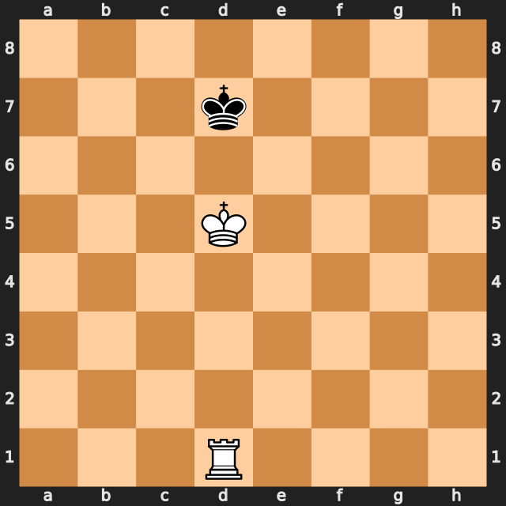

# Chess RL Project



This repository contains the final project for the **Reinforcement Learning** exam at the **University of Trieste**.

The objective is to develop a chess game environment and implement various **Reinforcement Learning (RL) algorithms** to solve simplified chess scenarios with a limited number of pieces, commonly known in chess terminology as **endgames**.

Project goals:

1. **Chess Environment Implementation** — A custom environment to simulate chess positions and moves.
2. **Reinforcement Learning Algorithms** — Design and train RL agents to play and solve specific endgame scenarios.


> **Note:** This README provides a high-level summary of the project structure, build instructions, and usage guidelines. For detailed documentation and design notes, please refer to the [`doc/`](./doc/) directory.


## Project Structure

```
chess/                              
├── 📁 include/                    
│   ├── bitboard.hpp               # Bitboard class for efficient board representation
│   ├── chessboard.hpp             # Chessboard class for game state management
│   ├── game.hpp                   # Game class (main game logic & interface)
│   ├── mcts.hpp                   # Monte Carlo Tree Search implementation
│   ├── move.hpp                   # Move class for representing chess moves
│   └── types.hpp                  # Common type definitions and enums
│
├── 📁 src/                       
│   ├── main.cpp                   # Entry point for standalone chess engine
│   ├── game.cpp                   # Game logic implementation
│   ├── chessboard.cpp             # Board state and move validation
│   └── move.cpp                   # Move generation and utilities
│
├── 📁 binding/                    
│   └── env_binding.cpp            
│
├── 📁 test/                       # Testing suite
│   ├── test_chessboard.cpp        
│   ├── test_game.cpp              
│   ├── test_move.cpp              
│   └── test_check.cpp             
│
├── 📁 doc/                        
│   ├── implementation.md          # Technical implementation details
│   ├── theory.md                  # Intro to chess programming
│   ├── demo.ipynb                 # Simple demo of the chess library 
│   └── project.md                 # RL project docs
│
├── 🔧 CMakeLists.txt              
├── 🚫 .gitignore                  
├── 📝 todo.md                    
└── 📖 README.md                   
```

### Component Overview

**Core Engine (C++)**
- `include/` + `src/`: Core chess implementation
- `build/ChessEngine`: Standalone executable for command-line play
- `test/`: Unit tests for validation

**User Interfaces**
- `assets/`: Visual chess piece representations

**Build & Development**
- `CMakeLists.txt`: Cross-platform build configuration
- `docs/`: Technical documentation and research materials

## Build Instructions

1. Create a build directory and navigate into it:
    ```sh
    mkdir build
    cd build
    ```

2. Configure the project using CMake:
    ```sh
    cmake ..
    ```

3. Build the project:
    ```sh
    make
    ```

### Running the Engine

- To run the chess game executable:
    ```sh
    ./Chess
    # or
    make play
    ```

- To run the tests:
    ```sh
    ./ChessTests
    # or
    ctest --verbose
    ```

- To clean the build dir:
    ```sh
    make clean_all
    ```
## Clone & set up a virtual environment

```
git clone <this-repo-url> chess_RL
cd chess_RL

python -m venv .venv
source .venv/bin/activate        # Windows: .venv\Scripts\activate
python -m pip install -U pip
```
install the python package
```
pip install -e .

```

## Dependencies

- C++17 compiler
- CMake (>= 3.10)
- [Google Test](https://github.com/google/googletest)

## Contributing

Contributions and suggestions are welcome! Please open an issue or submit a pull request.

